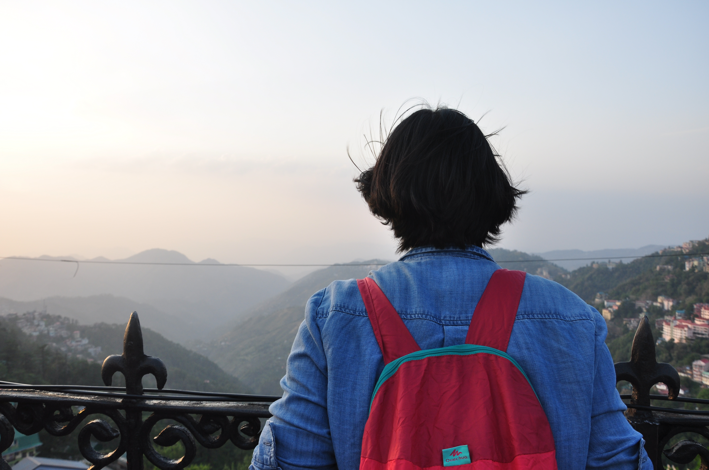

# “Wasn’t it scary?”
Is one of the first things that people ask me after I tell them that I spent almost a month backpacking solo and visited 7 cities. The first time I was asked this, I immediately responded saying no, not at all. To be honest, I was quite surprised at how quickly I was able to answer that question as prior to leaving for my trip, I won’t deny feeling a bit anxious about my ambitious feat of solo travel. My quick response only showed how much I have learned and grown as a traveler. I strongly believe that every woman should travel solo at some point in their lives.

What I Didn’t Learn in School! Seeing new places, meeting different people, trying some tasty dishes will definitely make you feel like living in an alternate world. I’ve had my share of ups and downs. Yes, as a solo woman traveler, you have to be a bit more cautious about your safety. However, traveling solo gave me a sense of freedom and independence which I take pride in. Whether it is a quick getaway, a week, a month, or a year, learn how to believe in your own strength as you grow as a person.

## Here are a few things I learned from being a solo woman traveler.

- **Hold yourself accountable**

    From my travels, I learned the real meaning of independence. Sure, I was never the type of woman who constantly needed someone but only through my travels I learned how to depend on no one else but myself. I made quick decisions, I learned from my mistakes, I became more confident and assertive of my rights.  Everywhere I went I faced different challenges, from navigating unknown pathways to going on 21-hour train or bus rides where I had to be smart, resourceful, and strong. If you find yourself always leaning on someone, whether it is a companion, a partner, or even a large group of friends, try going solo for a couple of days. Take the time to discover your own strengths and weaknesses as you embrace who you are as a person. Accountability ensures action and can force you to follow through when a lack of energy would otherwise hold you back.

- **Research places to go**

    Keep reading about the places you want to visit and eventually you’ll get there. It may sound trite, but by keeping travel on my mind, I’m always excited about my future trips. I’m constantly researching destinations online, reading news from overseas, looking up flights, reading blogs, and generally getting to know the world better. The more I learn about different places, the more I think, “There are so many places to see, and no time to waste! Let’s go book a flight!”

- **I Learned How to Enjoy My Own Company**

    One of the most beautiful things about solo travel is that I could do whatever I wanted. If I wanted to spend an entire day reading a book instead of joining a tour, I could. If I wanted to walk through the rain just to eat Maggi for breakfast I could. If I wanted to leave a place on a whim, I could. I was the captain of my own ship and I marched to the beat of my own drum. I had no one to consult decisions with, I had no itinerary to follow except that of my own. Because of this, I got past what people expected me to do while traveling and only did things which I wanted to. Start your day by thinking “What can I do today that would make me happy?”  You would be surprised to see how many people do things just because other people are doing it as well. I have seen people trudge through temples looking like that was the last place they wanted to be, only because they were traveling as a group. Not only you will find yourself happier, but you will also find yourself to be less willing to put up with other people’s crap and finally start pursuing the things that you want.

    Only through my travels, I learned how to truly enjoy my own company. I found people watching me as I pondered about both profound and mundane thoughts. “Am I doing what I want out of this life?” “What makes me happy?” or even something as simple as “What I want to do today?” Suddenly, I found myself enjoying my own company as I explored new cities and towns.

- **I Learned to Believe in Myself, in the Goodness in People and This World**

    I Learned How to Believe “I can never travel by myself because…” “I want to do it, but I am afraid because…”  Moreover, I get females who are either too scared because they get consumed by the negativity of media or the world. Yes, there are a lot of scary things that can happen to you, but if you fill yourself with fear, you will never know what could happen.

    My father would always be worried sick about me and I perfectly understood why. Despite his fears, I went anyways and realized along the way that traveling solo has increased my skill on how to read people, how to gauge situations, and how to ultimately trust my gut instinct. I have learned how to be more aware of my surroundings, how to be more mindful of my belongings and bearings, and ultimately how to be street smart. I found my confidence growing, my sense of direction (slightly) improving, and overall growing as a person. Believe that you are strong and capable to do the things that you never thought you could. Whether it is going out of your comfort zone by speaking to a stranger or learning how to read a map and find your way through a foreign city, believe in yourself and what you can do.

    There had been so many times where I  faced fears or worries, yet every single time, I have been shown wrong. Complete strangers have opened up their homes to me, people have gone out of their way to help me out, and on multiple times my faith in humanity had been restored. Yes, as a woman, you must be extra cautious about certain things, however, I have found that people will be willing to help you out when you need it the most. Because I believe traveling is one of the best educations that someone can have, I could go on and on about how traveling solo taught me how to be stronger, wiser, and kinder but in reality, nothing will happen if you just keep reading things. Take that leap of faith, gather up the courage, and go on a trip by yourself. Get to know yourself away from other people, and ultimately, learn how to believe that you are capable!

    <a href="https://fierecelynomad.wordpress.com/2018/07/23/go-solo/" target="_blank" rel="noopener noreferrer" style="text-decoration:none;">
    | Moved from the original post
    </a>

`#travel` `#solotravel`

---

  <a href="https://twitter.com/beingbhuminist" target="_blank" rel="noopener noreferrer" style="text-decoration:none;margin-right:5px;">
    twitter
  </a>
  <a href="https://www.linkedin.com/in/bhumika-jain-sheth-22564721b/" target="_blank" rel="noopener noreferrer" style="text-decoration:none;margin-right:5px;">
    linkedin
  </a>
  <a href="https://www.instagram.com/beingbhuminist/" target="_blank" rel="noopener noreferrer" style="text-decoration:none;margin-right:5px;">
    instagram
  </a>
  <a href="https://www.facebook.com/Bhumika.Jain.007" target="_blank" rel="noopener noreferrer" style="text-decoration:none;margin-right:5px;">
    facebook
  </a>
  <a href="https://open.spotify.com/user/c52a3w6e1bf38tfbnuhdkhv9j?si=ea61aa4387ca4a23" target="_blank" rel="noopener noreferrer" style="text-decoration:none;margin-right:5px;">
    spotify
  </a>

