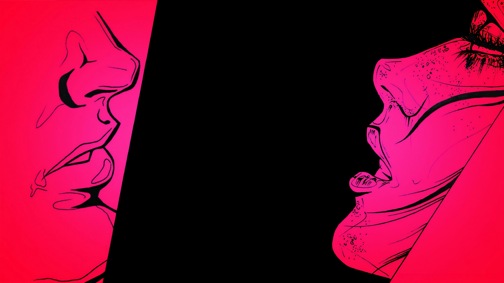

Is having ‘somebody to love’ the most important thing in your life? Do you constantly believe that with ‘the right man’ you would no longer feel depressed or lonely? Are you bored with ‘nice guys’ who are open, honest and dependable?

Robin Norwood, a California therapist, fully believes that women mired in obsessive relationships–those they suspect are all wrong for them but cannot shake–are as sick as drug addicts or alcoholics.

“There's absolutely no difference between being addicted to relationships and to drugs,” she insists.” People in these relationships get just as out of control and sick physically as do drug addicts. Their lives deteriorate in just the same way.”

Norwood is talking about women–everybody knows at least one, probably more–who find nice, stable and appropriate men b-o-r-i-n-g, who prefer angry, elusive men in need of understanding, troubled men in need of fixing and comforting.

These women may sense they have a problem, though not as alarming a problem as Norwood suggests. They know being in love is not supposed to mean being in pain all the time. They know they're wrong to think if they love him enough he'll change, that the holes in the relationship will close up. They may realize that the men they love are just plain unavailable. But they can't tear themselves away–and therein the junkie analogy. These women are so obsessed, so fearful of abandonment they'll do most anything to keep the relationship, however rotten, from caving in.

Like drugs, these women use relationships to alter their emotional states,” Norwood says. ”They're hurting and they want this man to appear, to say the right thing so that they can feel differently. When he goes away or doesn't do those things, the woman keeps turning to him like someone turns to a drug, wanting it to work. Like with drugs, the relationship keeps her out of touch with reality, out of touch with how sick she is getting. And it gets worse, not better. She grows more dependent on him and begins to ignore all the other sources of good things in the world.

Typically, Norwood says, women who love too much–and can't stop–come from dysfunctional homes in which their own early needs weren't met. Maybe there was actual abuse in the house; maybe just quiet, constant tension that children feel keenly. Perhaps parents competed for the child's allegiance; perhaps the parents, themselves bereft, had little emotional fodder left for their kids. Whatever the roots, standards for honest, right love and feelings become warped.

These women, having received little valid nurturing, try to fill the need by becoming care-givers themselves, especially to needy men. That the men who attract us most strongly are those who appear to be needy makes sense if we understand that it is our own wish to be loved and helped that is at the root of the attraction.

A man who appeals to her need not necessarily be penniless or in ill health. Perhaps he is unable to relate well to others or is cold and unaffectionate, or stubborn or selfish, or sulking or melancholy. Maybe he is a bit wild and irresponsible, or unable to make a commitment or be faithful. Or maybe he tells her that he has never been able to love anyone. Depending on her own background, she will respond to different varieties of neediness. But respond will, with the conviction that this man needs her help, her compassion, and her wisdom in order to improve his life.

Precisely because these women as kids couldn't reach their parents, they zealously respond to emotionally unavailable men. This type is quite familiar to them as it duplicates that early struggle when, in her book Norwood says, ”we tried to be good enough, loving enough, worthy enough, helpful enough and smart enough to win the love, attention, and approval from those who could not give us what we needed because of their own problems and preoccupations. Now we operate as though love, attention, and approval don't count unless we are able to extract them from a man who is also unable to readily give them to us. When faced with such destructive relationships, women with healthier histories more easily recognize their folly. Women who love too much, Norwood says, ”assume that if it isn't working and we aren't happy, then somehow we haven`t done enough yet. We see every nuance of behavior as perhaps indicating that our partner is finally changing.”

In fact, ‘why do they become obsessed with these men?’

All the evidence points to the fact that these women repeat the pattern and seemingly learned nothing from their prior unhappy experiences.

There are many reasons that make us choose to stay in a bad relationship.

On a superficial level practical reasons, such as financial dependence, living arrangements, children, judgment from others and possible career problems could be valid reasons.

On a deeper level, you will encounter thoughts that are internalised and that make it more difficult to end the relationships.

## These are automatic thoughts that are learned, such as:

- **Love is forever**
- **Being alone is horrible**
- **You’re not supposed to hurt others**
- **You’re supposed to stand by your man**
- **Women are caretakers**
- **I’ll never find someone else**
- **I’m not interesting or attractive enough**
- **If I try hard enough this relationship will work**

What always impressed me about these cases was the intensity of their obsessional symptoms and their inability to gain an understanding of what was causing their symptoms.

Obsessional thinking is viewed as a defense mechanism that the patient is unwittingly using to hide something else. In other words, “if I think about this all day then I need not think about something deeper and more troubling.” So, what was being hidden by the obsessional thoughts?

It is not about how to find a right man but to stop for a while and work on her own healing. Recovery is so hard, she has to go through the stuff she'll do anything to avoid. She has to begin the work of loving her own self. Most importantly ‘Letting go of loving too much’. It does not mean we never love, never nurture, never help, never soothe or stimulate or seduce our partner. It means we relate to him as an expression of our own essence rather than because we are trying to elicit a response or create an effect or produce a change in him.

In order to heal from your relationship addiction, you need to learn a completely new way of living. You need to heal the wounds from your childhood and more recent wounds and you have to learn how to treat yourself and to deal with your feelings (and others) in a loving, respectful way. You have to learn to love yourself and become your own loving father/mother figure and to get in touch with your inner voice and to learn how to trust it. To become responsible for your own life, well-being and to be self-reliant, so that you are not easy prey for all kinds of (well-meaning) people around you.

The woman who has recovered will love herself sufficiently. She won't need to be needed in order to feel worthwhile. She'll let go of disabling relationships without sinking into despair and she'll know that relationships work when those involved share values and goals rather than unhealthy needs. Above all, she'll have come to cherish her own serenity.

She needs an experience whereby she can learn a different way of living. It is difficult to remove blinders from one’s eyes and see what is really happening.

What are your experiences, opinions, and questions about this difficult issue?

    <a href="https://www.mentalhelp.net/women-who-love-too-much-are-you-one-of-them/" target="_blank" rel="noopener noreferrer" style="text-decoration:none;margin-right:5px;">
    | Reference post
    </a>
    <a href="https://www.pinterest.fr/pin/155303887180686174/" target="_blank" rel="noopener noreferrer" style="text-decoration:none;margin-right:5px;">
    | Reference image
    </a>
    <a href="https://fierecelynomad.wordpress.com/2019/06/25/women-who-love-too-much-confuses-love-with-obsession/" target="_blank" rel="noopener noreferrer" style="text-decoration:none;">
    | Moved from the original post
    </a>

`#psychology` `#love` `#obsession`

---

  <a href="https://twitter.com/beingbhuminist" target="_blank" rel="noopener noreferrer" style="text-decoration:none;margin-right:5px;">
    twitter
  </a>
  <a href="https://www.linkedin.com/in/bhumika-jain-sheth-22564721b/" target="_blank" rel="noopener noreferrer" style="text-decoration:none;margin-right:5px;">
    linkedin
  </a>
  <a href="https://www.instagram.com/beingbhuminist/" target="_blank" rel="noopener noreferrer" style="text-decoration:none;margin-right:5px;">
    instagram
  </a>
  <a href="https://www.facebook.com/Bhumika.Jain.007" target="_blank" rel="noopener noreferrer" style="text-decoration:none;margin-right:5px;">
    facebook
  </a>
  <a href="https://open.spotify.com/user/c52a3w6e1bf38tfbnuhdkhv9j?si=ea61aa4387ca4a23" target="_blank" rel="noopener noreferrer" style="text-decoration:none;margin-right:5px;">
    spotify
  </a>

