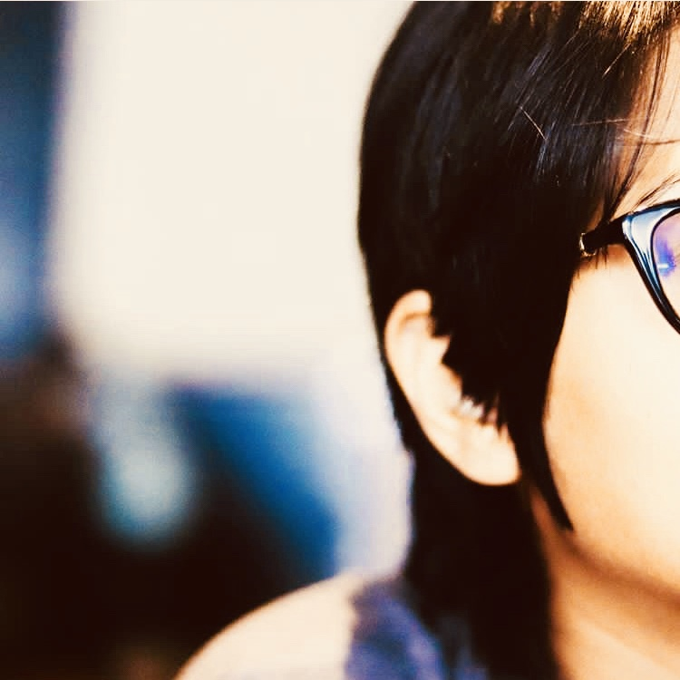

There are few girls who would dare to deny this universal truth transcendent among women of all ages residing across the seemingly infinite expanse of the universe: There is no material possession in our lives rich with greater substance than our **HAIR**.

I don’t care if its length surpasses the curve of your waist or if it’s razor-cut and asymmetrical. After all, what is a more powerful way to embark on a journey of personal transformation than, to begin with, the literal cutting off of the old and starting anew?

It’s the shedding of old skin. It’s akin to the feeling of checking heavy baggage at the airport and finally being free to run around with just your coin purse. It’s like pushing a reset button on your life.

Having short hair can be a blessing and a curse. The cursing part usually comes from the repetitive attention you get regarding the length of your hair. It’s not anyone’s fault, though. Society is wired to have these weird stigmas about the length of hair.

I for one, have had short hair for almost a year and I’m continuously surprised about how interested people are in my journey. Hair comes in all different shades and lengths if you’re willing to explore your options.

If you’re riding the short hair train like me, you know you’re tired of hearing or answering these things at every stop along the way.

## “DON’T YOU MISS HAVING LONGER HAIR?”

Sometimes, people actually cut their hair because that’s a style they’re a lot more comfortable in. Besides, we miss a lot of things in life; that doesn’t mean we necessarily need them. Also, does anyone ask a person who gets their ends cut off if they miss having them around?

## “WOW, YOU’RE SO BOLD.”

It’s a haircut, not warming up for the games, people. Again, this goes back to acquaintances thinking you’re taking a risk because you make yourself more susceptible to judging and questioning with short hair.

## “YOU’RE SO LUCKY YOUR HAIR IS SHORT.”

Lucky? Not quite. You dont need to comb or maintain your hair.  Now, winning a lottery would fall under the category of being “lucky.” Cutting your hair is a choice, for the most part, and a lifestyle that can easily be changed if you want it to. If cutting your hair makes you lucky, then I must be some mystic unicorn with rainbow poo.

## “WHEN ARE YOU GOING TO GROW IT OUT AGAIN?”

I haven’t set an expiration date for my short hair. Why do you suddenly have to counteract my choice for short hair? Yes, it will grow back, but I can make the choice to cut it again. Are you understanding the cycle yet?

## “HOW COULD YOU CUT OFF ALL OF YOUR BEAUTIFUL HAIR?!”

Well, there are these amazing places called barbershops and hair salons that welcome you and your hair with open arms. If you can manage to sit for long enough, you can leave with some beautiful results. The only effort it takes to cut your hair is getting up, going out, and doing it.

## “WHAT DOES [ENTER SO’S NAME] THINK?”

Hey, aren’t I the one who’s walking around with my head every day? Of course, you’ll consider what your man will think about your new cut, but it’s ultimately your decision. No one’s opinions should give validation to how you want to look.

## “YOU LOOK LIKE [ENTER PERSON WITH SHORT HAIR].”

Every time someone said I looked like someone I totally didn’t, just because we both had short hair. It’s sort of understandable but becomes a little absurd because you and this person couldn’t look more different. People with short hair aren’t interchangeable; we’re all unique.

Having short hair is probably one of the best decisions I ever made. At the end of the day, it’s what makes me the most comfortable in my skin… and that’s all that should really matter. If a hairstyle represents a woman’s personality, why are women reluctant to be daring with theirs?

Well, probably because women fear men will be less attracted to avant-garde hairstyles. And they’re somewhat justified in that belief, too. I hope to inspire women to be confident in their personal style and never be afraid of trying something new. That’s the type of attitude that will always steal the spotlight, regardless of any hairstyle. Hairstyles, like any type of style, will reflect back on you.

The more daring you are with your cut, the more daring you will make yourself appear in social or dating situations.

At the end of the day, conventional beauty is just that: conventional.

You might appeal to the masses with a regular, classic hairstyle – but you’ll attract other, more interesting people **by doing things differently**.

Style always recognizes the style.

    <a href="https://fierecelynomad.wordpress.com/2018/08/11/my-journey-with-pixie-makeover/" target="_blank" rel="noopener noreferrer" style="text-decoration:none;">
    | Moved from the original post
    </a>

`#misc` `#makeover` `#pixie` `#haircut`

---

  <a href="https://twitter.com/beingbhuminist" target="_blank" rel="noopener noreferrer" style="text-decoration:none;margin-right:5px;">
    twitter
  </a>
  <a href="https://www.linkedin.com/in/bhumika-jain-sheth-22564721b/" target="_blank" rel="noopener noreferrer" style="text-decoration:none;margin-right:5px;">
    linkedin
  </a>
  <a href="https://www.instagram.com/beingbhuminist/" target="_blank" rel="noopener noreferrer" style="text-decoration:none;margin-right:5px;">
    instagram
  </a>
  <a href="https://www.facebook.com/Bhumika.Jain.007" target="_blank" rel="noopener noreferrer" style="text-decoration:none;margin-right:5px;">
    facebook
  </a>
  <a href="https://open.spotify.com/user/c52a3w6e1bf38tfbnuhdkhv9j?si=ea61aa4387ca4a23" target="_blank" rel="noopener noreferrer" style="text-decoration:none;margin-right:5px;">
    spotify
  </a>

